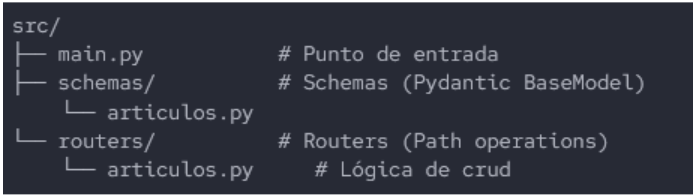

  
**Backend**

**TP EVALUATIVO**

**OBJETIVO:**  
Aplicar todo lo aprendido hasta esta primera mitad de año, desarrollando de esta manera un sistema que permita el uso de diversas herramientas que otorga el framework de FastAPI.

**MODALIDAD:**  
El trabajo práctico tendrá una nota en conjunto con la materia ***Frontend*** y nacerá de un promedio entre la nota particular de este ***TP Evaluativo*** en conjunto con la nota particular del ***TP01*** de frontend.

El desarrollo será individual.

El práctico se debe defender de manera oral, mostrando el proyecto en funcionamiento y respondiendo preguntas sobre el mismo, poniendo en práctica los conocimientos aprendidos respecto al funcionamiento del framework.

Se usarán las horas de clase para el desarrollo del trabajo práctico, quedando yo a disposición para cualquier consulta que surja durante el desarrollo del práctico. 

La fecha límite de entrega para ambos proyectos será el **Jueves 25 de Junio**.

**REQUISITOS:**  
El sistema debe cumplir con los siguientes requisitos:

* Estructura del proyecto:  
  * Debe ser una app de FastAPI, con las dependencias instaladas en un entorno virtual con el paquete de *fastapi”\[standard\]”*.  
  * Debe haber en la raíz del proyecto un *requirements.txt* que refleje las versiones de los paquetes instalados en el entorno virtual.  
  * La app debe estar modularizada, de manera tal que la estructura sea la siguiente:

    

    requirements.txt, venv/ y demás archivos deben estar al mismo nivel que src, no dentro.

* Requisitos de main.py (o app.py):  
  * Instanciar FastAPI.  
  * Personalizar título en la documentación.  
  * Configurar CORS (*Para permitir la conexión con el TP01 Evaluativo de la materia PP1 \- JavaScript)*  
  * Incluir routers existentes a la instancia de FastAPI.  
* Requisitos de los modelos de Pydantic:  
  * Deben existir por lo menos dos clases para validar datos: Una para la respuesta general (incluye id) y otra para las vistas de edición (no incluye id).  
  * El tipo de cada campo debe ser un Annotated que incluya metadatos a través de un Field().  
* Requisitos para los routers (Path Operations)  
  * Debe existir una variable que simule una tabla de una base de datos. Dicha tabla es de temática libre, pero debe contener sí o sí en su estructura un id, y otros 3 campos. (Dicha estructura tiene que estar validada por su modelo de Pydantic)  
  * Deben existir 5 Path operations en un mismo archivo, para permitir las operaciones CRUD que trabajamos (1 create, 2 read, 1 update y 1 delete).  
  * Los parámetros que reciban estos Path Operations deben estar tipados con Annotated y hacer uso de Path() o Query() con metadatos si correspondiese.  
  * Los endpoints que busquen coincidencias por id deben levantar un error 404 con HTTPException().  
  * Los endpoints que levanten dicho error deben tenerlo documentado en /docs.  
  * Los endpoints también deben incluir un response\_model para documentar la salida del path operation en /docs.